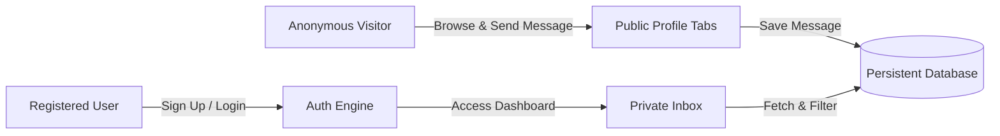

# Software Requirements Specification (SRS)
## Anonymous Messaging Platform ("AnonMsg")
**Standard**: IEEE 830-1998 Conforming Specification  
**Version**: 1.0.0  
**Status**: Approved Baseline  
**Prepared by**: `cs-product-manager` & `cs-ux-researcher`

---

## 1. Introduction

### 1.1 Purpose
This document specifies the software requirements for **AnonMsg**, an interactive web application that enables visitors to discover available user profiles, send anonymous or signed messages to any selected user, and provides authenticated recipients with a dashboard to view, filter, organize, and share received messages.

### 1.2 Scope
AnonMsg facilitates safe, engaging, and frictionless communication. It bridges public curiosity and personal privacy through:
- An open discovery portal where users can browse community members via profile tabs and search.
- An intuitive compose flow where senders default to anonymity (`[ Anonymous]`) but can opt to identify themselves.
- A secure authentication system for profile owners to claim their handles, customize their public bio and prompts, and access an inbox.
- Anti-harassment safeguards including character length constraints, flood-prevention rate limits, and abusive phrase sanitization.

### 1.3 Definitions, Acronyms, and Abbreviations
- **AnonMsg**: The anonymous messaging web application.
- **Anonymous Sender**: A visitor who sends a message without disclosing their identity.
- **Named Sender**: A visitor who enters a chosen pseudonym or real name in the sender field.
- **Recipient**: A registered user on the platform who receives messages sent to their profile.
- **Profile Tab**: A dedicated visual card and selector representing an available user.
- **Story Card**: An exportable, graphic representation of a received message suitable for social media sharing.

---

## 2. Overall Description

### 2.1 Product Perspective
AnonMsg operates as a responsive Single-Page Application (SPA) backed by a lightweight REST API server and persistent relational database (SQLite). The client communicates via JSON over HTTP.

### 2.2 User Classes and Characteristics
1. **Unauthenticated Visitor (Guest / Sender)**:
   - Browses active user tabs/profiles.
   - Selects a user to send a message.
   - Configures sender identity (defaults to Anonymous; toggleable to custom name).
   - No login required to send messages.
2. **Registered User (Recipient / Profile Owner)**:
   - Owns a unique handle (e.g., `@alex`).
   - Customizes profile prompt (e.g., "Send me your honest thoughts!").
   - Accesses authenticated `/inbox` view.
   - Manages messages (reads, filters by anonymous/named, deletes, favorites, exports shareable cards).

### 2.3 Operating Environment
- Modern desktop and mobile web browsers (Chrome, Safari, Firefox, Edge).
- Node.js runtime environment (LTS).

---

## 3. Specific Requirements

### 3.1 External Interface Requirements
#### 3.1.1 User Interfaces
- **UI-01 (Landing / Discovery)**: A directory displaying all registered users as interactive profile tabs and searchable cards.
- **UI-02 (Compose Modal / Drawer)**: A clean modal triggered by clicking "Send Message" on any profile tab, featuring:
  - Recipient summary (avatar, name, prompt).
  - Textarea with live character counter (1–500 chars).
  - Identity selector: Radio/Toggle switch between "Remain Anonymous" and "Include My Name".
  - Name text input (revealed when "Include My Name" is active).
  - "Send Message" action button with loading and success states.
- **UI-03 (Authentication Modal)**: Tabbed modal for Login and Sign Up with real-time field validation.
- **UI-04 (Inbox Dashboard)**: Authenticated screen displaying:
  - Stats overview (Total received, % Anonymous, % Named, Unread count).
  - Filter pills (`All`, `Anonymous Only`, `Named Only`, `Unread`, `Favorites`).
  - Chronological message cards with prominent badge tagging: `[ Anonymous]` or `[ Sender Name]`.
  - Action icons: Toggle Read/Unread, Star/Favorite, Delete, and "Share Card".
- **UI-05 (Social Story Card Exporter)**: Modal preview rendering the question in a vibrant Instagram-story-style card with a "Copy to Clipboard" or "Save Image" option.

### 3.2 Functional Requirements

#### 3.2.1 User Directory & Profile Discovery
- **FR-01**: The system shall retrieve and display all active registered users.
- **FR-02**: Visitors shall be able to filter users by search keyword (name, handle, or bio).
- **FR-03**: Each user tab shall display: avatar, display name, handle (`@username`), bio, availability status ("Online" / "Available"), and active prompt.

#### 3.2.2 Message Submission Flow
- **FR-04**: Senders shall submit messages without requiring authentication or email verification.
- **FR-05**: The message body must be between 1 and 500 characters.
- **FR-06**: Senders shall be presented with an identity selection:
  - Default state: **Anonymous** (`is_anonymous = true`, `sender_name = null`).
  - Optional state: **Named** (`is_anonymous = false`, `sender_name = <custom string>`).
- **FR-07**: When Anonymous is chosen, any entered name shall be cleared and omitted from the request payload to ensure anonymity.
- **FR-08**: The system shall apply a client-side and server-side rate limit (e.g., maximum 5 messages per 60 seconds per IP) to deter automated spam.
- **FR-09**: Upon successful transmission, the sender shall receive visual confirmation and the compose form will reset.

#### 3.2.3 User Authentication & Profile Ownership
- **FR-10**: Visitors can register by providing: username (alphanumeric, 3–20 chars, unique), display name, password (minimum 6 chars), optional bio, and optional prompt.
- **FR-11**: Registered users can log in using their username and password.
- **FR-12**: Passwords must be securely hashed with bcrypt prior to storage.
- **FR-13**: Authenticated sessions shall be maintained via secure tokens stored in browser session/local storage.

#### 3.2.4 Recipient Inbox
- **FR-14**: Authenticated users can access their dedicated inbox at `/inbox`.
- **FR-15**: Users shall only be permitted to view messages addressed to their own user ID.
- **FR-16**: Each message in the inbox shall display:
  - Content text.
  - Submission timestamp (formatted in relative time, e.g., "5 minutes ago", with full tooltip).
  - Identity badge: `[ Anonymous]` or `[ <sender_name>]`.
  - Read/unread status flag.
  - Favorite/star flag.
- **FR-17**: The recipient shall be able to mark messages as read/unread, toggle favorite status, or delete messages permanently.
- **FR-18**: The recipient shall be able to filter their message feed by status: All, Anonymous Only, Named Only, Unread, or Favorites.

---

## 4. Non-Functional Requirements

### 4.1 Security Requirements
- **SEC-01 (Anonymity Guarantee)**: When a message is sent anonymously, the sender's IP address or client metadata shall NOT be exposed to the recipient.
- **SEC-02 (Credential Protection)**: Passwords must never be stored in plain text.
- **SEC-03 (Access Control)**: API endpoints serving inbox contents must verify the caller's authentication token and reject unauthorized requests with HTTP 401/403.
- **SEC-04 (Input Sanitization)**: All inputs (messages, names, bios) must be sanitized against Cross-Site Scripting (XSS).

### 4.2 Performance & Usability
- **PERF-01**: Profile directory and inbox loading must render within 200ms under standard local conditions.
- **USE-01 (Rich Aesthetics)**: The application must adhere to modern UI guidelines: curated color palette (obsidian/slate with neon violet and cyan accents), high-contrast readable typography, subtle glassmorphism, and responsive mobile-first layouts.

---

## 5. Acceptance Criteria
1. Any unauthenticated visitor can browse user tabs and send an anonymous message to a selected profile.
2. Senders can easily toggle between "Anonymous" and entering a custom name; default is strictly Anonymous.
3. Users can register new accounts and log into existing accounts.
4. Recipients immediately see incoming messages with explicit distinction between anonymous senders and identified senders.
5. Message cards can be organized, deleted, starred, and exported into visual social cards.
