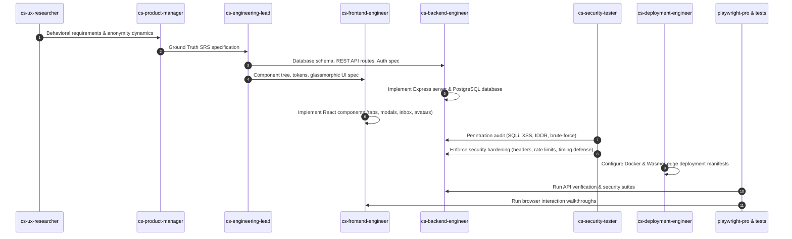

# Multi-Agent Workflow Execution & Delivery Plan
## Anonymous Messaging Platform ("AnonMsg")
**Source Repository**: [alirezarezvani/claude-skills](https://github.com/alirezarezvani/claude-skills)  
**Location**: `.agents/`  
**Standard**: Agentic Pair-Programming & Automated Verification

---

## 1. Multi-Agent Orchestration Framework

This project incorporates specialized agents and skills sourced from `alirezarezvani/claude-skills` to conduct structured software engineering:

---

## 2. Agent Execution Checklist

### Phase 1: Ground Truth Specification & Setup (Completed)
- [x] Download core agents (`cs-ux-researcher`, `cs-product-manager`, `cs-engineering-lead`, `cs-frontend-engineer`, `cs-backend-engineer`, `cs-fullstack-engineer`, `cs-karpathy-reviewer`, `cs-project-manager`, `cs-security-tester`, `cs-deployment-engineer`) into `.agents/agents/`.
- [x] Download verification skills (`api-test-suite-builder`, `code-reviewer`, `playwright-pro`, `a11y-audit`, `security-tester`, `deployment-engineer`) into `.agents/skills/`.
- [x] Author formal IEEE 830 SRS (`docs/SRS.md`).
- [x] Author System Architecture & Schema (`docs/ARCHITECTURE.md`).
- [x] Author UI/UX Design System Specification (`docs/UI_UX_SPECIFICATION.md`).

### Phase 2: Implementation & Refinements (Completed)
- [x] Full PostgreSQL database integration with connection pooling (`server/db.js`).
- [x] Remove all user photos, replacing them with typographic initials avatars (`src/components/UserAvatar.jsx`).
- [x] Implement unselected landing screen where visitors explore members before composing.
- [x] Redesign Profile & Prompt Settings modal with live character counts and dark glass styling.
- [x] Purge all 1-click demo login buttons and demo helper methods.
- [x] Configure Wasmer edge deployment (`wasmer.toml`, `Dockerfile`).

### Phase 3: Security Hardening & Penetration Testing (Completed)
- [x] Disable Express fingerprinting (`x-powered-by`).
- [x] Inject HTTP security headers (`X-Content-Type-Options`, `X-Frame-Options`, `X-XSS-Protection`, `Referrer-Policy`).
- [x] Restrict request payloads to 64kb.
- [x] Sanitize HTML inputs to prevent Stored XSS.
- [x] Atomic SQL IDOR authorization guards (`WHERE id = $1 AND recipient_id = $2`).
- [x] Constant-time dummy hash comparison against timing attacks.
- [x] Enforce 8-128 character password policy.
- [x] Redact IP addresses from recipient inbox payloads.
- [x] Execute automated Security Penetration Suite (`server/tests/security.test.js`): 17/17 tests passing.
- [x] Execute automated API Contract Suite (`server/tests/api.test.js`): 15/15 tests passing.
